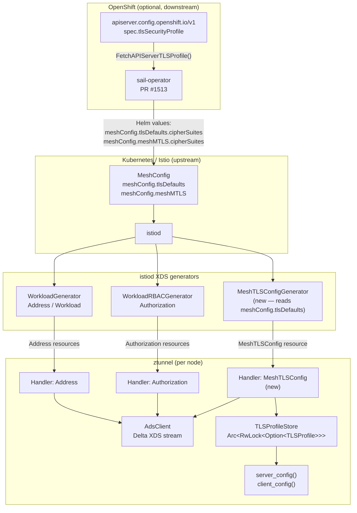

# Proposal: Dynamic TLS Profile Configuration for ztunnel via XDS

**To:** Zuzana Miklánková (@zmiklank)
**Context:** Follow-up to our meeting with Nick — design analysis for your review

Hi Zuzana,

After our meeting I spent some time going deep into the ztunnel and istiod
codebases to map out exactly what would need to change to make ztunnel's TLS
configuration dynamic via XDS. I am writing this up so you have something
concrete to react to, and so that whatever direction you decide to take, the
analysis might save you some time.

This is entirely yours to use, ignore or redirect as you see fit — I just
thought it would be more useful to show up with a documented proposal than with
vague ideas, and I am keen to help with the work in whatever way is most
useful to you.

---

## 1. Problem statement

ztunnel's TLS parameters are determined at compile time or at process startup
and cannot be updated while ztunnel is running:

- **TLS protocol versions** are controlled by the `TLS12_ENABLED` and
  `COMPLIANCE_POLICY` environment variables, read once at startup into
  `Lazy<bool>` statics (`src/lib.rs`).
- **Cipher suites** and **key exchange groups** are hardcoded per crypto
  provider in `src/tls/lib.rs` (lines 76–161), selected entirely by the
  same static env vars.

`meshConfig.tlsDefaults` already allows istiod to push TLS configuration to
Envoy sidecars at runtime, but **ztunnel does not participate in that
mechanism at all**. The relevant function `applyTLSDefaults()` in
`cluster_tls.go` generates Envoy `UpstreamTlsContext` — a format that ztunnel
neither generates nor consumes.

This means:

- Changing ztunnel's TLS policy in a running cluster requires a DaemonSet
  rollout with updated env vars — affecting every node simultaneously.
- Organizations with strict TLS compliance requirements (FIPS, custom cipher
  policies) cannot apply those requirements to ztunnel without redeployment.
- There is an operational inconsistency between sidecar mode (TLS configurable
  via MeshConfig at runtime) and Ambient mode (requires a restart).

This is a direct blocker for
[istio/istio#52926](https://github.com/istio/istio/issues/52926) (Ambient mode
incompatible with FIPS because TLS 1.2 cannot be configured centrally) and is
also the core issue behind the
[sail-operator#1513](https://github.com/istio-ecosystem/sail-operator/pull/1513)
work to propagate OpenShift's `TLSSecurityProfile`.

---

## 2. Current ztunnel XDS subscriptions

For context, ztunnel currently subscribes to exactly two XDS resource types
(`src/xds/types.rs`):

| Type URL                                           | Purpose                   |
| -------------------------------------------------- | ------------------------- |
| `type.googleapis.com/istio.workload.Address`       | Workload and service data |
| `type.googleapis.com/istio.security.Authorization` | RBAC policies             |

There is no mechanism for istiod to push global mesh configuration — TLS
settings included — to ztunnel via XDS today.

---

## 3. Proposed approach: new XDS resource type `MeshTLSConfig`

The cleanest upstream solution I can see is to add a new XDS resource type
that carries the global TLS profile for the mesh, following the same pattern
already established by `Address` and `Authorization`.

### Why a new resource type and not an alternative?

Before proposing this, I evaluated three other options:

| Option                                    | Problem                                                                                                                         |
| ----------------------------------------- | ------------------------------------------------------------------------------------------------------------------------------- |
| Extend PCDS (`ProxyConfig`)               | Gated on `features.MultiRootMesh`; `ProxyConfig` is an Envoy-specific proto conceptually wrong for ztunnel mesh config          |
| `Extension` field on `Workload`/`Service` | TLS profile is global, not per-workload; embedding it in every workload resource wastes bandwidth and is semantically incorrect |
| Continue using env vars                   | Cannot be updated at runtime; is exactly the problem                                                                            |

A dedicated resource type is independently versioned, zero-cost when unused,
and follows the pattern reviewers already know.

### 3.1 Proto definition

The new message would live in `proto/workload.proto` (same package as
`Address`):

```protobuf
// MeshTLSConfig carries the global TLS configuration for the mesh.
// The control plane pushes this resource to ztunnel instances to
// configure TLS parameters at runtime, overriding compiled-in defaults.
// Primary XDS key: mesh name (e.g. "default").
message MeshTLSConfig {
  // min_protocol_version is the minimum TLS version to accept.
  // TLS_AUTO means: use the compiled-in default.
  TLSProtocolVersion min_protocol_version = 1;

  // max_protocol_version is the maximum TLS version to negotiate.
  // TLS_AUTO means: use the compiled-in default.
  TLSProtocolVersion max_protocol_version = 2;

  // cipher_suites lists the permitted cipher suites (TLS 1.2 only;
  // TLS 1.3 suites are not negotiable per RFC 8446).
  // Empty means: use the compiled-in defaults.
  repeated string cipher_suites = 3;

  // ecdh_curves lists the permitted ECDH key exchange groups.
  // Empty means: use the compiled-in defaults.
  repeated string ecdh_curves = 4;
}

enum TLSProtocolVersion {
  TLS_AUTO = 0;
  TLSv1_2  = 1;
  TLSv1_3  = 2;
}
```

### 3.2 Full data flow



### 3.3 ztunnel changes (summary)

The changes in ztunnel follow a pattern that is already well-established in the
codebase:

**`proto/workload.proto`** — add `MeshTLSConfig` message and
`TLSProtocolVersion` enum.

**`src/xds/types.rs`** — add constant:

```rust
pub const MESH_TLS_CONFIG_TYPE: Strng =
    strng::literal!("type.googleapis.com/istio.workload.MeshTLSConfig");
```

**`src/tls/config.rs`** (new file) — `TLSProfile` (internal representation)
and `TLSProfileStore` (shared reader/writer):

```rust
pub struct TLSProfile {
    pub min_version:   Option<TLSVersion>,
    pub max_version:   Option<TLSVersion>,
    pub cipher_suites: Vec<String>,
    pub ecdh_curves:   Vec<String>,
}

#[derive(Clone, Default)]
pub struct TLSProfileStore {
    inner: Arc<RwLock<Option<TLSProfile>>>,
}
```

**`src/state.rs`** — `MeshTLSConfigHandler`:

```rust
impl Handler<XdsMeshTLSConfig> for MeshTLSConfigHandler {
    // Singleton resource, no on-demand lookup needed
    fn no_on_demand(&self) -> bool { true }

    fn handle(&self, res: Box<&mut dyn Iterator<Item = XdsUpdate<XdsMeshTLSConfig>>>)
        -> Result<(), Vec<RejectedConfig>>
    {
        handle_single_resource(res.into_iter(), |update| match update {
            XdsUpdate::Update(cfg) => {
                let profile = parse_and_validate(cfg)?; // NACK on invalid config
                self.store.update(Some(profile));
            }
            XdsUpdate::Remove(_) => {
                self.store.update(None); // fall back to compiled-in defaults
            }
        })
    }
}
```

Registration alongside existing handlers:

```rust
// src/state.rs — ProxyStateManager::new()
xds::Config::new(config.clone(), tls_client_fetcher)
    .with_watched_handler::<XdsAddress>(xds::ADDRESS_TYPE, updater.clone())
    .with_watched_handler::<XdsAuthorization>(xds::AUTHORIZATION_TYPE, updater)
    .with_watched_handler::<XdsMeshTLSConfig>(       // new
        xds::MESH_TLS_CONFIG_TYPE,
        MeshTLSConfigHandler::new(tls_profile_store.clone()),
    )
```

**`src/tls/lib.rs`** — new profile-aware functions that fall back to the
current behavior when `profile` is `None`:

```rust
pub fn tls_versions_with_profile(profile: Option<&TLSProfile>)
    -> Vec<&'static rustls::SupportedProtocolVersion> { ... }

pub fn provider_with_profile(profile: Option<&TLSProfile>)
    -> Arc<CryptoProvider> { ... }  // always a subset of the compiled provider
```

**`src/tls/certificate.rs`** — `server_config()` and `client_config()` each
receive an additional `Option<&TLSProfile>` parameter and pass it to the
functions above.

### 3.4 Backwards compatibility

- If no `MeshTLSConfig` resource is ever received (older istiod, feature
  disabled), behavior is identical to today.
- `TLS12_ENABLED` and `COMPLIANCE_POLICY` env vars continue to work as the
  compiled-in defaults.
- Only **new** TLS connections use the updated profile. In-flight sessions are
  not renegotiated.

### 3.5 istiod companion change

A separate PR to `istio/istio` would add a `MeshTLSConfigGenerator` that reads
from `meshConfig.tlsDefaults` (and `meshConfig.meshMTLS` for mTLS-specific
settings) and produces the `MeshTLSConfig` XDS resource for ztunnel instances.
This is the same source of truth that already feeds Envoy's TLS configuration,
so it creates a consistent API surface for both proxy types.

---

## 4. Relationship to your existing work

Your PR #1711 (`add support for TLSv1.2`) introduced the `TLS12_ENABLED` env
var with the explicit note "until we have FIPS-140-3 support in istiod". This
proposal is essentially that follow-up: replacing the static env var with a
dynamic XDS-driven mechanism, while keeping `TLS12_ENABLED` as the compiled-in
fallback for deployments that do not use the new feature.

Your PR #1743 (OpenSSL PQC provider) adds a new crypto provider to the same
`src/tls/lib.rs` functions this proposal refactors (`provider()`). The
`provider_with_profile()` function would need to handle the OpenSSL provider
the same way as the others — using a subset-filter approach — so the two
changes should compose without conflict. Worth double-checking with you though,
since you know that code from the inside.

---

## 5. Questions where I would value your input

I made some design calls that I am not fully confident about, and you know this
codebase much better than I do:

1. **Proto placement**: I put `MeshTLSConfig` in `workload.proto`
   (`istio.workload` package) because it follows the same pattern as `Address`.
   Is that the right home, or would you put it somewhere else — a dedicated
   `mesh.proto`, or as an extension to the existing `MeshConfig` proto in
   the istio-api repo?

2. **Singleton modelling**: I treated this as a single resource per mesh
   (key = mesh name). Is there any case where different ztunnel nodes should
   receive different TLS profiles?

3. **NACK vs. silent fallback**: when the received profile is invalid (e.g.,
   `min > max`, or the filtered cipher list is empty), I have the handler
   sending a NACK. Is that preferable, or should it log and fall back to
   defaults silently?

4. **PR #1513 dependency**: the sail-operator PR is on hold due to
   `tlsStrictAdherence`. Should the ztunnel change wait for that to resolve,
   or is it worth proposing upstream independently given that the use case
   is broader than OpenShift?

---

## 6. How I can help

If the design looks reasonable to you and you decide to move forward with it,
I am happy to take on whatever parts are most useful — drafting the upstream
issue, writing tests, implementing specific pieces of the ztunnel change, or
doing the companion istiod work. Just point me at what would be most helpful.

If the approach needs significant rethinking, I am equally happy to help
iterate on the design before anything goes public.

Either way, the analysis is there for you to use as you see fit.
