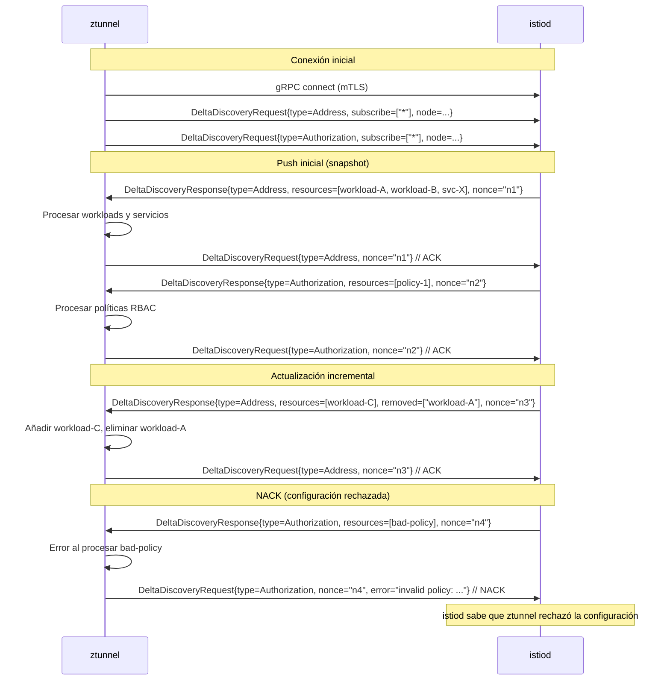
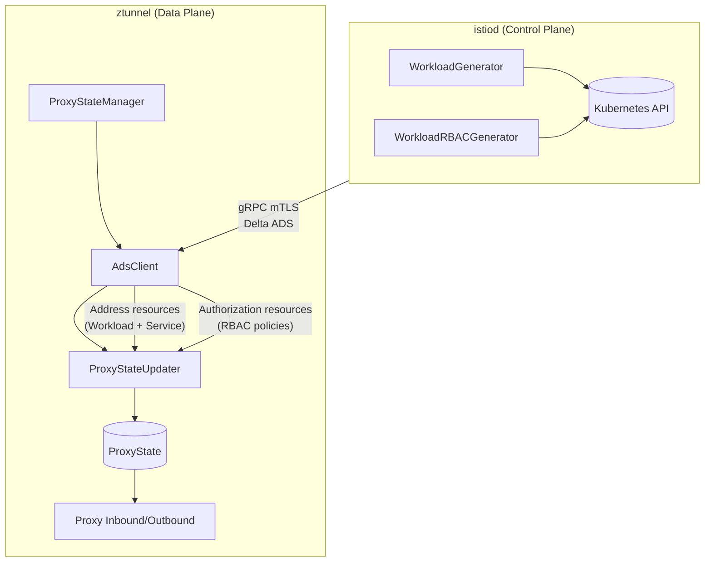
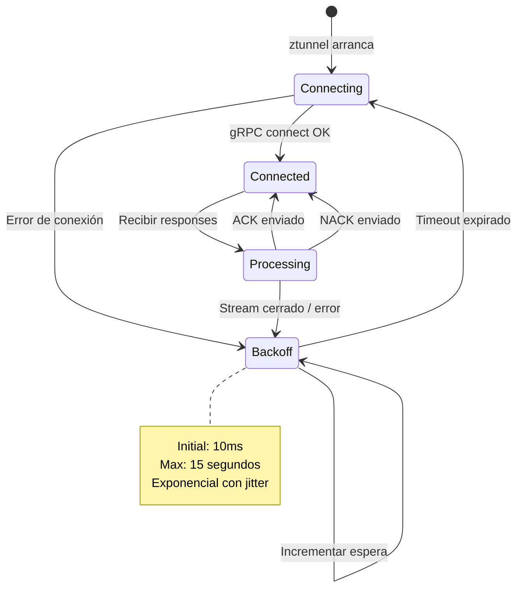
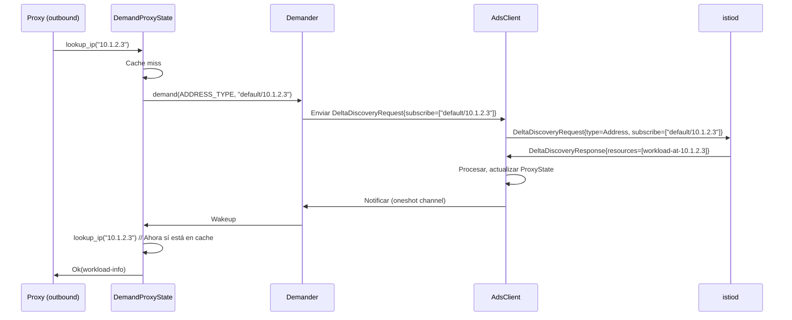
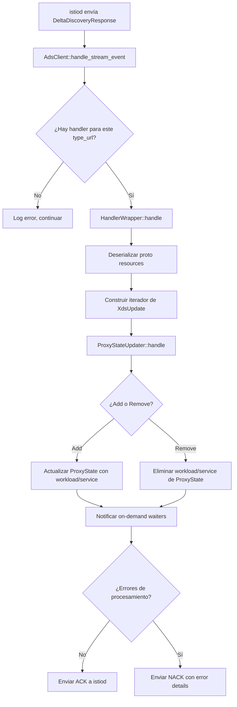
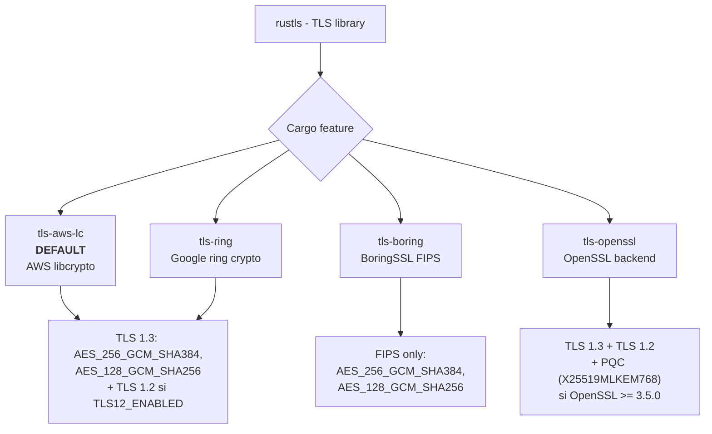
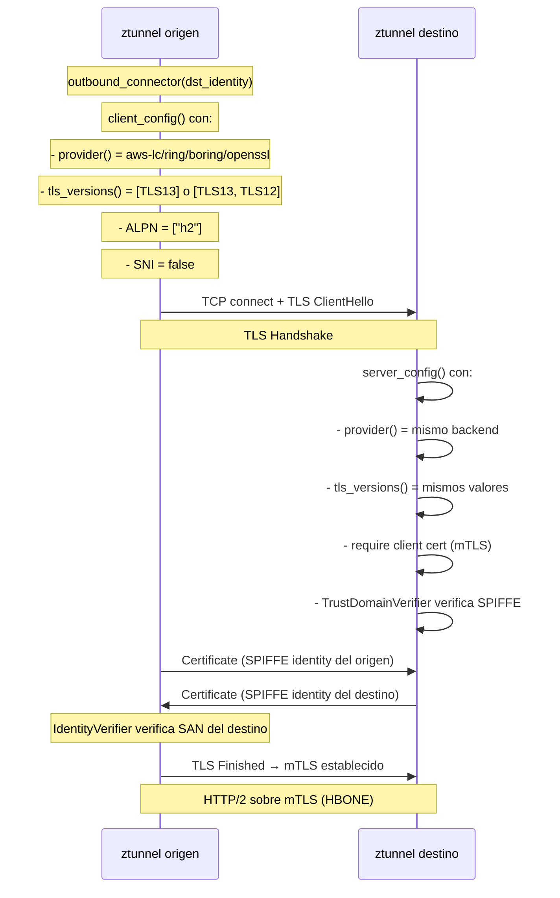
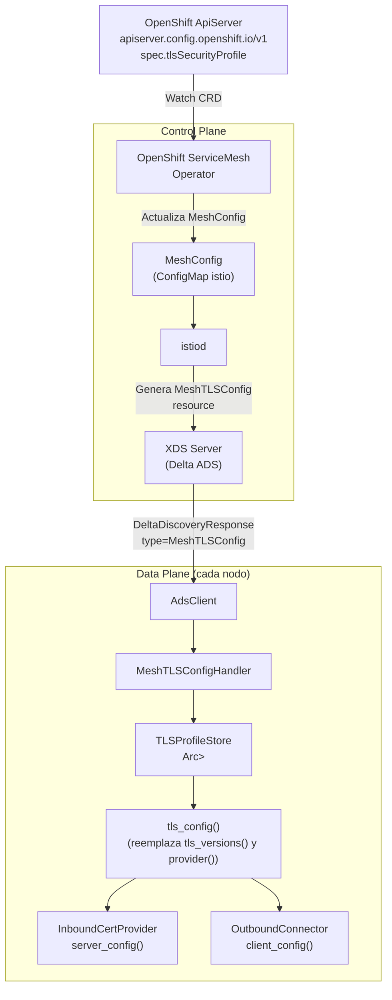
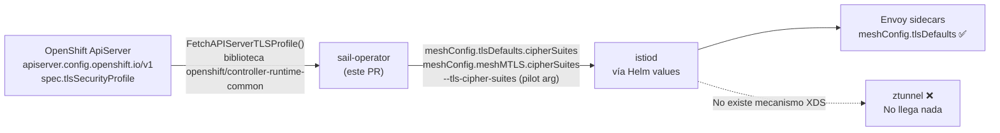
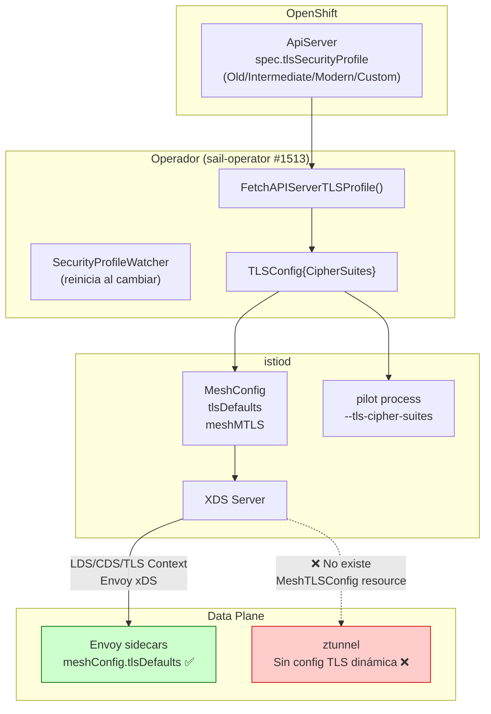

# Configuración TLS via XDS en ztunnel

**Contexto:** Este documento explica cómo funciona XDS, cómo lo usa ztunnel actualmente, cómo está configurado TLS, y qué cambios son necesarios para hacer la configuración TLS dinámica y configurable desde el control plane (istiod). El objetivo final es que el perfil TLS de OpenShift (`apiserver.config.openshift.io/v1` → `spec.tlsSecurityProfile`) pueda propagarse desde istiod hasta ztunnel a través del protocolo XDS.

---

## Tabla de Contenidos

1. [El Protocolo XDS: Fundamentos](#1-el-protocolo-xds-fundamentos)
2. [XDS en ztunnel: Estado Actual](#2-xds-en-ztunnel-estado-actual)
3. [Configuración TLS en ztunnel: Estado Actual](#3-configuración-tls-en-ztunnel-estado-actual)
4. [Cambios Necesarios para TLS-por-XDS](#4-cambios-necesarios-para-tls-por-xds)
5. [Estado del Ecosistema: Upstream, Issues y el PR del Operador](#5-estado-del-ecosistema-upstream-issues-y-el-pr-del-operador)

---

## 1. El Protocolo XDS: Fundamentos

### 1.1 ¿Qué es XDS y por qué existe?

XDS (abreviatura de "x Discovery Service") es un protocolo de configuración dinámica originalmente diseñado para [Envoy Proxy](https://www.envoyproxy.io/). Su propósito es resolver un problema fundamental en los service meshes: **cómo llevar configuración de red a miles de proxies de forma dinámica, sin reiniciarlos**.

La idea central es una separación clara de responsabilidades:

- **Control Plane** (istiod): sabe cómo debe estar configurada la red. Entiende el estado del cluster, las políticas de seguridad, los servicios disponibles.
- **Data Plane** (ztunnel, Envoy): se encarga de mover paquetes. No tiene lógica de negocio. Recibe su configuración del control plane via XDS.

Sin XDS, cada proxy necesitaría reiniciarse o recargar archivos de configuración para adaptarse a los cambios de red. Con XDS, los proxies establecen una conexión gRPC persistente con el control plane y reciben actualizaciones en tiempo real.

### 1.2 Los Tipos de Recursos XDS

En el estándar original de Envoy, hay 6 tipos de recursos principales. Ztunnel usa una variante simplificada, pero es importante entender el modelo completo para comprender las decisiones de diseño:

| Tipo     | Nombre                     | ¿Qué configura?                                 | Analogía                                            |
| -------- | -------------------------- | ----------------------------------------------- | --------------------------------------------------- |
| **LDS**  | Listener Discovery Service | Puertos en los que escuchar, protocolo, filtros | "¿En qué números de teléfono estás disponible?"     |
| **RDS**  | Route Discovery Service    | Cómo enrutar peticiones entrantes               | "¿A quién transfiero la llamada según quién llama?" |
| **CDS**  | Cluster Discovery Service  | Grupos de backends (upstream clusters)          | "¿Qué grupos de servidores existen?"                |
| **EDS**  | Endpoint Discovery Service | IPs individuales dentro de cada cluster         | "¿Qué servidores hay dentro de cada grupo?"         |
| **SDS**  | Secret Discovery Service   | Certificados TLS y claves privadas              | "¿Qué credenciales usar para cada conexión?"        |
| **RTDS** | Runtime Discovery Service  | Flags de configuración en tiempo de ejecución   | "Parámetros de comportamiento en caliente"          |

Ztunnel **no usa** estos tipos estándar de Envoy. En cambio, usa tipos propios del Istio Workload API:

| Type URL                                           | Nombre        | ¿Qué configura?                                  |
| -------------------------------------------------- | ------------- | ------------------------------------------------ |
| `type.googleapis.com/istio.workload.Address`       | Address       | Información de workloads y servicios en la malla |
| `type.googleapis.com/istio.security.Authorization` | Authorization | Políticas RBAC para el tráfico                   |

Estos tipos son específicos del ambient mesh de Istio, diseñados para ser más eficientes que los tipos estándar de Envoy para el caso de uso de ztunnel.

### 1.3 State-of-the-World vs Delta XDS

Existen dos variantes del protocolo XDS:

**State-of-the-World (SotW):** En cada actualización, el control plane envía el estado **completo** de todos los recursos de ese tipo. El cliente reemplaza su estado interno con lo recibido. Simple pero ineficiente para clusters grandes.

```
istiod → ztunnel: [workload-A, workload-B, workload-C]   (3 workloads)
(alguien añade workload-D)
istiod → ztunnel: [workload-A, workload-B, workload-C, workload-D]  (4 workloads)
```

**Delta XDS:** Solo se envían los **cambios** (recursos añadidos o eliminados). Mucho más eficiente en clusters con miles de workloads.

```
istiod → ztunnel: [workload-A, workload-B, workload-C]   (snapshot inicial)
(alguien añade workload-D)
istiod → ztunnel: added=[workload-D]  (solo el cambio)
(alguien borra workload-B)
istiod → ztunnel: removed=[workload-B]  (solo el cambio)
```

**Ztunnel usa exclusivamente Delta XDS** (método `delta_aggregated_resources` en el gRPC service). Esto es esencial para el modo on-demand que veremos más adelante.

### 1.4 ADS: Aggregated Discovery Service

En lugar de tener una conexión gRPC separada para cada tipo de recurso (una para LDS, otra para CDS, etc.), ADS permite multiplexar todos los tipos sobre una **única conexión gRPC**. Esto reduce la complejidad de gestión de conexiones y garantiza el orden de actualización entre tipos relacionados.

```
// Sin ADS: múltiples conexiones
ztunnel ─── gRPC stream LDS ──→ istiod
ztunnel ─── gRPC stream CDS ──→ istiod
ztunnel ─── gRPC stream EDS ──→ istiod

// Con ADS: una sola conexión
ztunnel ─── gRPC stream ADS ──→ istiod
              (LDS, CDS, EDS, Authorization, Address... todo aquí)
```

El servicio gRPC de ADS está definido en el proto de Envoy:

```protobuf
// proto/xds.proto (compilado en ztunnel)
service AggregatedDiscoveryService {
  // Bidirectional streaming RPC
  rpc DeltaAggregatedResources(stream DeltaDiscoveryRequest)
      returns (stream DeltaDiscoveryResponse) {}
}
```

### 1.5 Mecánica del Protocolo: Subscribe → Push → ACK/NACK

El flujo básico de XDS funciona así:

1. **El cliente se conecta** y envía un `DeltaDiscoveryRequest` indicando a qué recursos quiere suscribirse.
2. **El servidor responde** con un `DeltaDiscoveryResponse` con los recursos actuales.
3. **El cliente procesa** los recursos y responde con ACK (éxito) o NACK (rechaza la configuración con motivo).
4. **Cuando algo cambia**, el servidor envía nuevas actualizaciones. Vuelta al paso 3.

Los mensajes proto clave son:

```protobuf
// Cliente → Servidor: "Suscríbeme a estos recursos" o "ACK/NACK de tu última respuesta"
message DeltaDiscoveryRequest {
  string type_url = 2;                          // Tipo de recurso (ej: istio.workload.Address)
  repeated string resource_names_subscribe = 3;  // Recursos a los que suscribirse
  repeated string resource_names_unsubscribe = 4; // Recursos de los que desuscribirse
  string response_nonce = 5;                     // Referencia a la respuesta que ACK/NACKamos
  google.rpc.Status error_detail = 6;            // Vacío=ACK, poblado=NACK con error
  core.Node node = 1;                            // Metadatos del proxy (se envía solo al inicio)
}

// Servidor → Cliente: "Aquí tienes los recursos actuales/cambios"
message DeltaDiscoveryResponse {
  string type_url = 4;                    // Tipo de recurso
  repeated Resource resources = 1;        // Recursos añadidos o actualizados
  repeated string removed_resources = 6;  // Nombres de recursos eliminados
  string nonce = 5;                       // Token único que el cliente usará en su ACK/NACK
}

// Un recurso individual dentro de la respuesta
message Resource {
  string name = 3;           // Nombre único del recurso
  google.protobuf.Any resource = 1;  // El recurso serializado (el proto real)
}
```

### 1.6 Flujo Completo: Diagrama



### 1.7 Subscripción Wildcard vs On-Demand

Hay dos modos de suscripción:

**Wildcard** (`subscribe=["*"]`): El servidor envía **todos** los recursos de ese tipo. Útil cuando el cliente necesita todo el estado (por ejemplo, Authorization policies que se aplican globalmente).

**On-demand** (`subscribe=["workload-uid-123"]`): El cliente solicita recursos **específicos** cuando los necesita. Ztunnel usa esto para workloads: no pide todos los workloads del cluster (pueden ser decenas de miles), sino que los solicita a medida que necesita enrutar tráfico a ellos.

El on-demand en ztunnel funciona así: cuando ztunnel necesita enrutar a una IP que no reconoce, envía un `DeltaDiscoveryRequest` con la IP/nombre concreto, istiod responde con el workload correspondiente, y ztunnel puede entonces enrutar correctamente.

---

## 2. XDS en ztunnel: Estado Actual

### 2.1 Arquitectura General



ztunnel establece **una única conexión gRPC** con istiod, protegida con mTLS, y a través de ella recibe todos sus recursos de configuración usando el protocolo Delta ADS.

### 2.2 Los Tipos XDS que Consume ztunnel

Actualmente ztunnel solo consume dos tipos XDS, definidos en `src/xds/types.rs`:

```rust
// src/xds/types.rs:44-46
pub const ADDRESS_TYPE: Strng =
    strng::literal!("type.googleapis.com/istio.workload.Address");
pub const AUTHORIZATION_TYPE: Strng =
    strng::literal!("type.googleapis.com/istio.security.Authorization");
```

**Address** (`istio.workload.Address`): Contiene la información de workloads y servicios del mesh. El proto `Address` es un `oneof` que puede ser un `Workload` (un pod, VM, etc.) o un `Service` (grupo de workloads). Ztunnel lo usa para saber qué IP corresponde a qué identidad SPIFFE, cómo conectarse con mTLS, etc.

**Authorization** (`istio.security.Authorization`): Contiene las políticas RBAC (AuthorizationPolicy de Istio). Ztunnel las usa para decidir si permitir o denegar tráfico.

### 2.3 El Sistema de Handlers: Arquitectura de Plugins

ztunnel usa un sistema de plugins para procesar recursos XDS. El trait central es:

```rust
// src/xds/client.rs:106-116
// Handler is responsible for handling a discovery response.
// Handlers can mutate state and return a list of rejected configurations (if there are any).
pub trait Handler<T: prost::Message>: Send + Sync + 'static {
    fn no_on_demand(&self) -> bool {
        false
    }
    fn handle(
        &self,
        res: Box<&mut dyn Iterator<Item = XdsUpdate<T>>>,
    ) -> Result<(), Vec<RejectedConfig>>;
}
```

Este trait es genérico sobre el tipo de proto `T`. Cualquier struct que implemente `Handler<MiMensajeProto>` puede registrarse como handler para el type URL correspondiente. El sistema es completamente extensible.

La función `handle()` recibe un iterador de `XdsUpdate<T>`, donde cada update puede ser:

- `XdsUpdate::Update(recurso)`: recurso nuevo o actualizado
- `XdsUpdate::Remove(nombre)`: recurso eliminado

Si el handler falla en procesar algún recurso, devuelve `Err(Vec<RejectedConfig>)` y ztunnel envía un NACK a istiod con los detalles del error.

### 2.4 Registro de Handlers y Configuración del Cliente XDS

La configuración del cliente XDS y el registro de handlers ocurre en `src/state.rs`:

```rust
// src/state.rs:1105-1114
let xds_client = if config.xds_address.is_some() {
    let updater = ProxyStateUpdater::new(state.clone(), cert_fetcher.clone());
    let tls_client_fetcher = Box::new(tls::ControlPlaneAuthentication::RootCert(
        config.xds_root_cert.clone(),
    ));
    Some(
        xds::Config::new(config.clone(), tls_client_fetcher)
            .with_watched_handler::<XdsAddress>(xds::ADDRESS_TYPE, updater.clone())
            .with_watched_handler::<XdsAuthorization>(xds::AUTHORIZATION_TYPE, updater)
            .build(xds_metrics, awaiting_ready),
    )
} else {
    None
};
```

El builder `xds::Config` registra handlers con `.with_watched_handler::<T>(type_url, handler)`. Internamente:

1. Almacena el handler en un `HashMap<Strng, Box<dyn RawHandler>>`
2. Añade un `DeltaDiscoveryRequest` inicial para suscribirse al type URL

```rust
// src/xds/client.rs:271-293
pub fn with_watched_handler<F>(self, type_url: Strng, f: impl Handler<F>) -> Config
where
    F: 'static + fmt::Debug + prost::Message + Default,
{
    let no_on_demand = f.no_on_demand();
    self.with_handler(type_url.clone(), f)
        .watch(type_url, no_on_demand)
}
```

### 2.5 El Struct `AdsClient`: El Motor de XDS

```rust
// src/xds/client.rs:412-422
pub struct AdsClient {
    config: Config,         // Handlers, address, TLS, metadata
    state: State,           // Known resources y pending on-demand requests
    pub(crate) metrics: Metrics,
    block_ready: Option<tokio::sync::watch::Sender<()>>,
    connection_id: u32,
    types_to_expect: HashSet<String>,
}
```

El `AdsClient` gestiona el ciclo de vida completo de la conexión XDS:

- Establece la conexión gRPC mTLS con istiod
- Envía los `DeltaDiscoveryRequest` iniciales para cada tipo registrado
- Recibe `DeltaDiscoveryResponse` en un loop asíncrono
- Invoca los handlers correspondientes
- Envía ACK o NACK según el resultado

### 2.6 Ciclo de Vida de la Conexión y Backoff



Si la conexión falla, ztunnel aplica exponential backoff:

- Inicio: 10ms
- Máximo: 15 segundos
- Estrategia: duplicar en cada intento

### 2.7 On-Demand Loading: Cómo Ztunnel Pide Recursos Bajo Demanda

Para el tipo `Address` (workloads), ztunnel no se suscribe a todos los workloads del cluster desde el inicio (sería ineficiente en clusters con miles de pods). En su lugar usa on-demand:



El struct `Demander` es quien coordina esto:

```rust
// src/xds/client.rs:438-470
pub struct Demander {
    demand: mpsc::Sender<(oneshot::Sender<()>, ResourceKey)>,
}

impl Demander {
    pub async fn demand(&self, type_url: Strng, name: Strng) -> Demanded {
        let (tx, rx) = oneshot::channel::<()>();
        self.demand
            .send((tx, ResourceKey { name, type_url }))
            .await
            .expect("demand channel should not close");
        Demanded { b: rx }
    }
}
```

### 2.8 Flujo de Procesamiento de un Recurso Address



---

## 3. Configuración TLS en ztunnel: Estado Actual

### 3.1 El Sistema de Crypto Providers

ztunnel usa **rustls** (implementación de TLS en Rust puro) con un sistema de backends de criptografía pluggable. El backend se selecciona en tiempo de compilación mediante Cargo features:



Cada backend implementa la función `provider()` en `src/tls/lib.rs` que construye un `Arc<CryptoProvider>` de rustls con los cipher suites y grupos de intercambio de claves específicos.

### 3.2 ¿Dónde Están Hardcodeados los Parámetros TLS?

#### 3.2.1 Versiones de TLS

Las versiones de TLS están hardcodeadas en `src/tls/lib.rs:42-52`:

```rust
// src/tls/lib.rs:42-52
static TLS_VERSIONS_13_ONLY: &[&rustls::SupportedProtocolVersion] =
    &[&rustls::version::TLS13];
static TLS_VERSIONS_12_AND_13: &[&rustls::SupportedProtocolVersion] =
    &[&rustls::version::TLS13, &rustls::version::TLS12];

pub fn tls_versions() -> &'static [&'static rustls::SupportedProtocolVersion] {
    if *TLS12_ENABLED {          // Lee una variable de entorno estática
        TLS_VERSIONS_12_AND_13
    } else {
        TLS_VERSIONS_13_ONLY     // DEFAULT: solo TLS 1.3
    }
}
```

La variable `TLS12_ENABLED` se lee de una variable de entorno **una sola vez al arrancar** (`src/lib.rs`):

```rust
// src/lib.rs (referenciado desde tls/lib.rs)
static TLS12_ENABLED: Lazy<bool> =
    Lazy::new(|| env::var("TLS12_ENABLED").unwrap_or_default() == "true");
```

Este es un valor **estático**: se inicializa una vez al arrancar y nunca cambia. No hay forma de actualizarlo sin reiniciar ztunnel.

#### 3.2.2 Cipher Suites

Los cipher suites están hardcodeados en la función `provider()` de cada backend. Ejemplo para `tls-aws-lc` (el backend por defecto):

```rust
// src/tls/lib.rs:95-118
#[cfg(feature = "tls-aws-lc")]
pub(super) fn provider() -> Arc<CryptoProvider> {
    let mut cipher_suites = vec![
        // TLS 1.3 cipher suites (siempre incluidos)
        rustls::crypto::aws_lc_rs::cipher_suite::TLS13_AES_256_GCM_SHA384,
        rustls::crypto::aws_lc_rs::cipher_suite::TLS13_AES_128_GCM_SHA256,
    ];
    if *TLS12_ENABLED {
        // TLS 1.2 cipher suites (solo si se activa TLS 1.2)
        cipher_suites.extend([
            rustls::crypto::aws_lc_rs::cipher_suite::TLS_ECDHE_RSA_WITH_AES_256_GCM_SHA384,
            rustls::crypto::aws_lc_rs::cipher_suite::TLS_ECDHE_RSA_WITH_AES_128_GCM_SHA256,
        ]);
    }
    let mut provider = CryptoProvider {
        cipher_suites,
        ..rustls::crypto::aws_lc_rs::default_provider()
    };
    if *PQC_ENABLED {
        // Post-quantum crypto: X25519MLKEM768 como único kx_group
        provider.kx_groups = vec![rustls::crypto::aws_lc_rs::kx_group::X25519MLKEM768]
    }
    Arc::new(provider)
}
```

La lista de cipher suites es **fija en tiempo de compilación** y su selección se controla únicamente por variables de entorno estáticas.

#### 3.2.3 Cipher Suites por Perfil Actual

| Activado cuando                | Cipher Suites                                                  |
| ------------------------------ | -------------------------------------------------------------- |
| Siempre (TLS 1.3)              | `TLS_AES_256_GCM_SHA384`, `TLS_AES_128_GCM_SHA256`             |
| `TLS12_ENABLED=true` (TLS 1.2) | + `ECDHE-RSA-AES256-GCM-SHA384`, `ECDHE-RSA-AES128-GCM-SHA256` |
| `COMPLIANCE_POLICY=pqc`        | kx_groups: `X25519MLKEM768` (post-quantum)                     |

### 3.3 TLS Inbound: Cómo se Configura la Recepción de Conexiones

Cuando otro ztunnel (o un workload) se conecta a ztunnel via HBONE (mTLS), la configuración del servidor TLS se crea en `src/tls/certificate.rs:301-338`:

```rust
// src/tls/certificate.rs:301-338
pub fn server_config(
    &self,
    crl_manager: Option<Arc<crate::tls::crl::CrlManager>>,
) -> Result<ServerConfig, Error> {
    // Configurar el verificador de certificados de cliente (mTLS)
    let mut builder = WebPkiClientVerifier::builder_with_provider(
        self.root_store.clone(),
        crate::tls::lib::provider(),   // <-- Provider hardcodeado (depende del feature)
    );

    // Añadir soporte CRL si está disponible
    if let Some(ref mgr) = crl_manager {
        let crls = mgr.get_crl_ders();
        if !crls.is_empty() {
            builder = builder.with_crls(crls).allow_unknown_revocation_status();
        }
    }

    let raw_client_cert_verifier = builder.build()?;
    let client_cert_verifier =
        crate::tls::workload::TrustDomainVerifier::new(raw_client_cert_verifier, td);

    let mut sc = ServerConfig::builder_with_provider(crate::tls::lib::provider())
        .with_protocol_versions(tls::tls_versions())   // <-- Versión TLS hardcodeada
        .expect("server config must be valid")
        .with_client_cert_verifier(client_cert_verifier)
        .with_single_cert(
            self.cert_and_intermediates_der(),
            self.private_key.clone_key(),
        )?;
    sc.alpn_protocols = vec![b"h2".into()];           // <-- ALPN hardcodeado a HTTP/2
    Ok(sc)
}
```

**Puntos clave hardcodeados:**

- La selección del crypto provider (via `tls::lib::provider()`) es fija
- Las versiones de TLS (via `tls::tls_versions()`) son estáticas
- ALPN es siempre `["h2"]` (HTTP/2)

### 3.4 TLS Outbound: Cómo se Configura la Iniciación de Conexiones

Cuando ztunnel inicia una conexión HBONE hacia otro ztunnel, la configuración TLS del cliente se crea en `src/tls/certificate.rs:342-358`:

```rust
// src/tls/certificate.rs:342-358
pub fn client_config(&self, identity: Vec<Identity>) -> Result<ClientConfig, rustls::Error> {
    let roots = self.root_store.clone();
    let verifier = IdentityVerifier { roots, identity };

    let mut cc = ClientConfig::builder_with_provider(crate::tls::lib::provider())
        .with_protocol_versions(tls::tls_versions())   // <-- Versión TLS hardcodeada
        .expect("client config must be valid")
        .dangerous()
        .with_custom_certificate_verifier(Arc::new(verifier))
        .with_client_auth_cert(
            self.cert_and_intermediates_der(),
            self.private_key.clone_key(),
        )?;
    cc.alpn_protocols = vec![b"h2".into()];    // <-- ALPN hardcodeado a HTTP/2
    cc.resumption = Resumption::disabled();     // <-- Sin session resumption
    cc.enable_sni = false;                      // <-- SNI deshabilitado
    Ok(cc)
}
```

### 3.5 TLS Control Plane: Conexión con istiod

La conexión gRPC de ztunnel con istiod (el canal XDS) también usa TLS, configurado en `src/tls/control.rs`:

```rust
// src/tls/control.rs:179-197
async fn control_plane_client_config(
    root_cert: &RootCert,
    alt_hostname: Option<String>,
) -> Result<ClientConfig, Error> {
    let roots = root_to_store(root_cert).await?;
    let c = ClientConfig::builder_with_provider(provider())  // provider() = lib::provider()
        .with_protocol_versions(crate::tls::tls_versions())?; // mismas versiones hardcodeadas
    // ... sin mTLS en la dirección ztunnel→istiod (solo istiod verifica ztunnel)
}
```

### 3.6 Diagrama: Flujo Completo TLS en una Conexión Inbound



### 3.7 Resumen de lo Hardcodeado

| Parámetro               | Valor Actual                                             | Dónde                            | ¿Configurable?             |
| ----------------------- | -------------------------------------------------------- | -------------------------------- | -------------------------- |
| TLS version min         | TLS 1.3 (o 1.2 con env var)                              | `src/tls/lib.rs:46-52`           | Solo al inicio via env var |
| TLS version max         | TLS 1.3 siempre                                          | `src/tls/lib.rs:42-52`           | No                         |
| Cipher suites TLS 1.3   | AES_256_GCM_SHA384, AES_128_GCM_SHA256                   | `src/tls/lib.rs:76-161`          | No                         |
| Cipher suites TLS 1.2   | ECDHE-RSA-AES256-GCM-SHA384, ECDHE-RSA-AES128-GCM-SHA256 | `src/tls/lib.rs:76-161`          | Solo al inicio via env var |
| ECDH curves (kx_groups) | Default del provider                                     | `src/tls/lib.rs:76-161`          | Solo PQC via env var       |
| ALPN protocols          | `["h2"]`                                                 | `src/tls/certificate.rs:336,354` | No                         |
| Session resumption      | Deshabilitado                                            | `src/tls/certificate.rs:355`     | No                         |
| SNI                     | Deshabilitado                                            | `src/tls/certificate.rs:356`     | No                         |
| mTLS                    | Siempre requerido                                        | `src/tls/certificate.rs:310-327` | No                         |

---

## 4. Cambios Necesarios para TLS-por-XDS

### 4.1 El Problema: Configuración Estática vs Dinámica

El problema fundamental es que **todos los parámetros TLS de ztunnel son estáticos**: se determinan al arrancar (desde variables de entorno o Cargo features) y nunca cambian en tiempo de ejecución. Esto impide que istiod pueda actualizar la configuración TLS de ztunnel después del despliegue.

Para que OpenShift pueda propagar el `TLSSecurityProfile` del ApiServer a ztunnel, necesitamos:

1. Un mecanismo para que istiod envíe la configuración TLS a ztunnel
2. Un handler en ztunnel para recibir y almacenar esa configuración
3. Que las funciones `tls_versions()` y `provider()` lean de ese estado dinámico

### 4.2 Decisión de Diseño: ¿Por Qué un Nuevo Tipo de Recurso XDS?

Hay tres opciones posibles para llevar la config TLS de istiod a ztunnel:

#### Opción A: Nuevo tipo de recurso XDS (RECOMENDADA para upstream)

**Ventajas:**

- Sigue el patrón ya establecido en ztunnel (Address, Authorization)
- Semánticamente correcto: la config de la malla es un "recurso" del control plane
- Fácil de versionar y extender en el futuro
- Genérico: no está acoplado a OpenShift
- Los reviewers upstream reconocerán el patrón

**Desventajas:**

- Requiere añadir un nuevo proto message y registrarlo en istiod

#### Opción B: PCDS (Proxy Configuration Discovery Service)

istiod ya tiene una implementación parcial de PCDS (`pilot/pkg/xds/pcds.go`), pero actualmente solo envía trust bundles (certificados CA). Ztunnel podría suscribirse a PCDS y recibir la config TLS allí.

**Por qué no es la mejor opción:**

- El proto de ProxyConfig de Istio es para configuración del proxy Envoy, no para ztunnel
- ztunnel actualmente no tiene código de PCDS (habría que añadir más infraestructura)
- Mezcla responsabilidades (configuración de proxy + configuración de malla)

#### Opción C: Extensions en Workload/Service

El proto `workload.proto` tiene un campo `repeated Extension extensions` tanto en `Workload` como en `Service`. Se podría añadir la config TLS como una extension embebida en estos recursos.

**Por qué no:** La config TLS es **global** (aplica a todas las conexiones), no es algo que varíe por workload o servicio. Seria conceptualmente incorrecto y habría que duplicar la información en cada workload. Los reviewers rechazarían esto.

#### Conclusión

La opción A (nuevo tipo de recurso XDS) es la correcta para un PR upstream. Explicamos los cambios desde este enfoque.

### 4.3 Diagrama del Sistema con el Cambio



### 4.4 Cambio 1: Nuevo Mensaje Proto en `workload.proto`

**Fichero:** `proto/workload.proto`

**Qué añadir:** Un nuevo mensaje `MeshTLSConfig` que representa la configuración TLS global de la malla.

**Por qué aquí:** El fichero `workload.proto` ya define los tipos de recursos que ztunnel consume del Istio Workload API. La configuración de la malla (mesh-level) encaja aquí conceptualmente, junto a la información de workloads y servicios.

```protobuf
// Añadir al final de proto/workload.proto, antes del último mensaje Extension

// MeshTLSConfig represents the global TLS configuration for the mesh.
// It is pushed by the control plane to configure TLS parameters on all
// ztunnel instances, overriding compile-time defaults.
// The primary key for this resource is the mesh name (typically "default").
message MeshTLSConfig {
  // min_protocol_version specifies the minimum TLS version to accept.
  // Supported values: "TLSv1_2", "TLSv1_3"
  // If unset, the compiled-in default is used (TLS 1.3).
  TLSProtocolVersion min_protocol_version = 1;

  // max_protocol_version specifies the maximum TLS version to negotiate.
  // Supported values: "TLSv1_2", "TLSv1_3"
  // If unset, the compiled-in default is used (TLS 1.3).
  TLSProtocolVersion max_protocol_version = 2;

  // cipher_suites specifies the list of cipher suites to allow.
  // For TLS 1.2: IANA names like "ECDHE-RSA-AES256-GCM-SHA384"
  // For TLS 1.3: cipher suites are not configurable per RFC 8446
  // If empty, the compiled-in defaults are used.
  repeated string cipher_suites = 3;

  // ecdh_curves specifies the list of ECDH curve groups for key exchange.
  // Examples: "P256", "P384", "X25519"
  // If empty, the compiled-in defaults are used.
  repeated string ecdh_curves = 4;
}

// TLSProtocolVersion specifies a TLS version.
enum TLSProtocolVersion {
  TLS_AUTO = 0;    // Use the compiled-in default
  TLSv1_2 = 1;
  TLSv1_3 = 2;
}
```

**Consideraciones de backwards compatibility en proto3:**

- Los campos numéricos con valor 0 no se serializan (son el "default" de proto3)
- Si istiod no envía un `MeshTLSConfig`, ztunnel usa sus defaults actuales
- Si istiod envía un `MeshTLSConfig` con campos vacíos, ztunnel usa sus defaults
- Esto garantiza que el cambio sea backwards compatible

**Nota importante para upstream:** El nombre y la organización del mensaje deben ser acordados con los maintainers de Istio. Es posible que prefieran otro nombre (por ejemplo `MeshConfig` con un subconjunto de campos) o que quieran añadirlo al proto de MeshConfig existente. El PR de proto debe ir acompañado de la implementación correspondiente en istiod.

### 4.5 Cambio 2: Registrar el Nuevo Type URL

**Fichero:** `src/xds/types.rs`

**Qué añadir:** Una constante para el nuevo type URL, siguiendo el patrón exacto de las constantes existentes.

```rust
// src/xds/types.rs - añadir junto a las constantes existentes

// Existing (no tocar):
pub const ADDRESS_TYPE: Strng =
    strng::literal!("type.googleapis.com/istio.workload.Address");
pub const AUTHORIZATION_TYPE: Strng =
    strng::literal!("type.googleapis.com/istio.security.Authorization");

// NEW:
pub const MESH_TLS_CONFIG_TYPE: Strng =
    strng::literal!("type.googleapis.com/istio.workload.MeshTLSConfig");
```

**Por qué:** ztunnel usa este type URL para:

1. Suscribirse al recurso en el `DeltaDiscoveryRequest` inicial
2. Enrutar las respuestas al handler correcto (el `HashMap<Strng, Box<dyn RawHandler>>`)

**Por qué el namespace `istio.workload`:** Mantiene la consistencia con `ADDRESS_TYPE` que también está en `istio.workload`. La configuración de la malla es parte del workload API de Istio ambient.

También hay que hacer que el código de compilación de protos (`build.rs`) incluya el módulo del nuevo mensaje si es necesario. Dado que `MeshTLSConfig` está en el mismo paquete `istio.workload` que `Address`, no se necesitan cambios adicionales en `build.rs` o en el módulo `istio::workload` de `types.rs` — el nuevo mensaje estará disponible automáticamente tras añadirlo al proto.

### 4.6 Cambio 3: Estado Global Dinámico para la Config TLS

**Fichero:** `src/state.rs` (y posiblemente un nuevo fichero `src/tls/config.rs`)

**Qué añadir:** Un store global y thread-safe para la configuración TLS recibida via XDS.

El punto de decisión clave aquí es: ¿`Arc<RwLock<Option<TLSProfile>>>` o `tokio::sync::watch`?

- **`Arc<RwLock<Option<TLSProfile>>>`**: Más simple. Los readers obtienen la config en el momento de crear cada `ServerConfig`/`ClientConfig`. No hay suscripción de cambios.
- **`tokio::sync::watch`**: Permite notificar reactivamente cuando la config cambia. Más útil si se necesita reiniciar listeners o hacer algo especial en el cambio.

Para este caso, `Arc<RwLock<>>` es suficiente porque:

- Las conexiones TLS se configuran en el momento de crear cada conexión nueva
- No hay conexiones persistentes que necesiten reconfiguración (TLS no soporta hot-reload por diseño)
- La config TLS del control plane no cambia frecuentemente

```rust
// src/tls/config.rs (fichero nuevo)

use std::sync::Arc;
use std::sync::RwLock;

/// TLSProfile holds the dynamic TLS configuration received from the control plane via XDS.
/// It overrides the compiled-in defaults for TLS version and cipher suites.
#[derive(Clone, Debug, PartialEq, Eq)]
pub struct TLSProfile {
    /// Minimum TLS version to accept. None means use compiled-in default.
    pub min_version: Option<TLSVersion>,
    /// Maximum TLS version to negotiate. None means use compiled-in default.
    pub max_version: Option<TLSVersion>,
    /// Allowed cipher suites. Empty means use compiled-in defaults.
    pub cipher_suites: Vec<String>,
    /// Allowed ECDH curves. Empty means use compiled-in defaults.
    pub ecdh_curves: Vec<String>,
}

#[derive(Clone, Debug, PartialEq, Eq)]
pub enum TLSVersion {
    TLS12,
    TLS13,
}

/// TLSProfileStore is a shared, thread-safe store for the current TLS profile.
/// It is updated by the XDS handler when the control plane sends a new MeshTLSConfig.
#[derive(Clone, Debug, Default)]
pub struct TLSProfileStore {
    inner: Arc<RwLock<Option<TLSProfile>>>,
}

impl TLSProfileStore {
    pub fn new() -> Self {
        Self::default()
    }

    /// Update the stored TLS profile (called by the XDS handler).
    pub fn update(&self, profile: Option<TLSProfile>) {
        let mut w = self.inner.write().expect("TLSProfileStore lock poisoned");
        *w = profile;
    }

    /// Read the current TLS profile.
    pub fn get(&self) -> Option<TLSProfile> {
        self.inner.read().expect("TLSProfileStore lock poisoned").clone()
    }
}
```

**Dónde integrar el `TLSProfileStore` en el estado existente:**

El store debe ser accesible desde:

- El XDS handler (para escribir cuando llega config nueva)
- Las funciones `server_config()` y `client_config()` en `certificate.rs` (para leer al crear conexiones)

La forma más limpia de hacerlo sin cambiar demasiado la API existente es añadirlo a `ProxyStateManager` y pasarlo por referencia donde se necesite:

```rust
// src/state.rs - cambios en ProxyStateManager

pub struct ProxyStateManager {
    state: DemandProxyState,
    xds_client: Option<AdsClient>,
    // NEW: store compartido para la config TLS recibida via XDS
    tls_profile: TLSProfileStore,
}
```

### 4.7 Cambio 4: Implementar el XDS Handler

**Fichero:** `src/state.rs` o un nuevo fichero `src/xds/tls_handler.rs`

**Qué crear:** Un struct que implemente `Handler<MeshTLSConfig>` (el tipo proto generado por prost).

El patrón a seguir es `ProxyStateUpdater`, que implementa los handlers para Address y Authorization. Observa cómo está estructurado:

```rust
// src/state.rs - patrón existente para ProxyStateUpdater
impl Handler<XdsAddress> for ProxyStateUpdater {
    fn handle(
        &self,
        res: Box<&mut dyn Iterator<Item = XdsUpdate<XdsAddress>>>,
    ) -> Result<(), Vec<RejectedConfig>> {
        handle_single_resource(res.into_iter(), |update| {
            match update {
                XdsUpdate::Update(w) => {
                    // Procesar el recurso
                    self.insert_workload(w)?
                }
                XdsUpdate::Remove(name) => {
                    // Eliminar el recurso
                    self.state.write().unwrap().workloads.remove_by_uid(&name);
                }
            }
            Ok(())
        })
    }
}
```

El nuevo handler para `MeshTLSConfig`:

```rust
// Nuevo handler - puede ir en src/state.rs o src/xds/tls_handler.rs

use crate::xds::types::istio::workload::MeshTlsConfig;  // Generado por prost
use crate::xds::client::{Handler, XdsUpdate, RejectedConfig, handle_single_resource};
use crate::tls::config::{TLSProfile, TLSProfileStore, TLSVersion};

pub struct MeshTLSConfigHandler {
    tls_store: TLSProfileStore,
}

impl MeshTLSConfigHandler {
    pub fn new(tls_store: TLSProfileStore) -> Self {
        Self { tls_store }
    }
}

impl Handler<MeshTlsConfig> for MeshTLSConfigHandler {
    // MeshTLSConfig is a singleton resource (only one per mesh).
    // We don't need on-demand lookups for it.
    fn no_on_demand(&self) -> bool {
        true
    }

    fn handle(
        &self,
        res: Box<&mut dyn Iterator<Item = XdsUpdate<MeshTlsConfig>>>,
    ) -> Result<(), Vec<RejectedConfig>> {
        handle_single_resource(res.into_iter(), |update| {
            match update {
                XdsUpdate::Update(cfg) => {
                    // Convert the proto message to our internal TLSProfile type
                    let profile = parse_mesh_tls_config(cfg)?;
                    self.tls_store.update(Some(profile));
                    tracing::info!("Updated TLS profile from control plane: {:?}",
                        self.tls_store.get());
                }
                XdsUpdate::Remove(_) => {
                    // If the control plane removes the config, fall back to defaults
                    self.tls_store.update(None);
                    tracing::info!("TLS profile removed from control plane, using defaults");
                }
            }
            Ok(())
        })
    }
}

/// Convert a proto MeshTlsConfig into our internal TLSProfile.
/// Returns an error if the configuration is invalid (causes NACK to control plane).
fn parse_mesh_tls_config(cfg: MeshTlsConfig) -> anyhow::Result<TLSProfile> {
    use crate::xds::types::istio::workload::TlsProtocolVersion;

    let min_version = match cfg.min_protocol_version() {
        TlsProtocolVersion::TlsAuto => None,
        TlsProtocolVersion::Tlsv12 => Some(TLSVersion::TLS12),
        TlsProtocolVersion::Tlsv13 => Some(TLSVersion::TLS13),
    };

    let max_version = match cfg.max_protocol_version() {
        TlsProtocolVersion::TlsAuto => None,
        TlsProtocolVersion::Tlsv12 => Some(TLSVersion::TLS12),
        TlsProtocolVersion::Tlsv13 => Some(TLSVersion::TLS13),
    };

    // Validate: min must be <= max if both are set
    if let (Some(min), Some(max)) = (&min_version, &max_version) {
        if min > max {
            anyhow::bail!("min_protocol_version cannot be greater than max_protocol_version");
        }
    }

    Ok(TLSProfile {
        min_version,
        max_version,
        cipher_suites: cfg.cipher_suites,
        ecdh_curves: cfg.ecdh_curves,
    })
}
```

**Puntos clave del handler:**

1. **`no_on_demand() → true`**: La config TLS es global (un recurso singleton para toda la malla), no tiene sentido pedirla bajo demanda. ztunnel se suscribe a ella desde el inicio y espera el push.

2. **`XdsUpdate::Remove`**: Si istiod elimina el recurso (por ejemplo, cuando el administrador borra la config), ztunnel debe caer de vuelta a sus defaults. Nunca debe quedarse en un estado inválido.

3. **NACK por config inválida**: Si `parse_mesh_tls_config` devuelve un error (por ejemplo, `min > max`), `handle_single_resource` lo convierte en un `RejectedConfig`, lo que provoca que el cliente XDS envíe un NACK a istiod. istiod sabrá que ztunnel rechazó la configuración y puede reportarlo en su estado/logs.

### 4.8 Cambio 5: Registrar el Handler en el XDS Client

**Fichero:** `src/state.rs`

Este es el cambio más pequeño pero fundamental: sin esta línea, ztunnel nunca se suscribirá al nuevo tipo.

```rust
// src/state.rs:1105-1114 - cambio mínimo necesario

let xds_client = if config.xds_address.is_some() {
    let updater = ProxyStateUpdater::new(state.clone(), cert_fetcher.clone());
    let tls_profile = TLSProfileStore::new();  // NEW: crear el store

    let tls_client_fetcher = Box::new(tls::ControlPlaneAuthentication::RootCert(
        config.xds_root_cert.clone(),
    ));
    Some(
        xds::Config::new(config.clone(), tls_client_fetcher)
            .with_watched_handler::<XdsAddress>(xds::ADDRESS_TYPE, updater.clone())
            .with_watched_handler::<XdsAuthorization>(xds::AUTHORIZATION_TYPE, updater)
            // NEW: suscribirse a la config TLS global
            .with_watched_handler::<MeshTlsConfig>(
                xds::MESH_TLS_CONFIG_TYPE,
                MeshTLSConfigHandler::new(tls_profile.clone()),
            )
            .build(xds_metrics, awaiting_ready),
    )
} else {
    None
};
```

**Qué ocurre internamente cuando se llama a `with_watched_handler`:**

1. `with_handler`: Envuelve el handler en `HandlerWrapper<MeshTlsConfig>` y lo guarda en `config.handlers[MESH_TLS_CONFIG_TYPE]`
2. `watch`: Construye un `DeltaDiscoveryRequest{type_url=MESH_TLS_CONFIG_TYPE, subscribe=[]}` (sin resources_subscribe vacío porque `no_on_demand=true`, lo que en el código actual significa suscripción wildcard implícita)

**Nota técnica sobre la suscripción:** Para el tipo `Authorization` y el nuevo `MeshTLSConfig`, ztunnel quiere recibir todos los recursos (no on-demand). El código en `construct_initial_request` (src/xds/client.rs:374-395) maneja esto: cuando `no_on_demand=true`, envía `subscribe=[]` y `unsubscribe=[]`, que en Delta XDS significa "suscríbeme a todo de forma wildcard".

### 4.9 Cambio 6: Hacer Dinámica la Función `tls_versions()` y `provider()`

**Fichero:** `src/tls/lib.rs`

Este es el **cambio más importante**: conectar el estado XDS dinámico con las funciones que realmente crean las configuraciones TLS de rustls.

**Situación actual:**

- `tls_versions()` lee `TLS12_ENABLED` (estático)
- `provider()` lee `TLS12_ENABLED` y `PQC_ENABLED` (estáticos)

**Lo que necesitamos:** Que estas funciones lean del `TLSProfileStore` cuando hay una config XDS activa, y caigan a los defaults si no.

La forma más limpia de hacerlo sin romper la API existente es añadir nuevas funciones que acepten un `Option<&TLSProfile>`:

```rust
// src/tls/lib.rs - nuevas funciones que aceptan config dinámica

use crate::tls::config::{TLSProfile, TLSVersion};

/// Returns the TLS versions to use, applying the dynamic profile if provided.
/// Falls back to the compiled-in defaults (TLS12_ENABLED env var) if no profile is set.
pub fn tls_versions_with_profile(
    profile: Option<&TLSProfile>,
) -> Vec<&'static rustls::SupportedProtocolVersion> {
    if let Some(p) = profile {
        match (&p.min_version, &p.max_version) {
            // Profile says TLS 1.2+ (Intermediate profile)
            (Some(TLSVersion::TLS12), _) => {
                vec![&rustls::version::TLS13, &rustls::version::TLS12]
            }
            // Profile says TLS 1.3 only (Modern profile)
            (Some(TLSVersion::TLS13), _) | (None, Some(TLSVersion::TLS13)) => {
                vec![&rustls::version::TLS13]
            }
            // No version specified in profile, use compiled-in defaults
            (None, None) => tls_versions().to_vec(),
        }
    } else {
        // No XDS profile, use compiled-in defaults
        tls_versions().to_vec()
    }
}

/// Returns a CryptoProvider configured with the dynamic TLS profile.
/// Falls back to compiled-in defaults if no profile is set.
pub fn provider_with_profile(profile: Option<&TLSProfile>) -> Arc<CryptoProvider> {
    // If no profile or empty cipher suites, use the current hardcoded provider
    let Some(p) = profile else { return provider(); };
    if p.cipher_suites.is_empty() && p.ecdh_curves.is_empty() {
        return provider();
    }

    // Start with the base provider for the compiled-in backend
    let base = provider();

    // Filter cipher suites if specified in the profile
    let cipher_suites = if p.cipher_suites.is_empty() {
        base.cipher_suites.clone()
    } else {
        // Filter the base provider's cipher suites to only those in the profile
        base.cipher_suites
            .iter()
            .filter(|cs| {
                let name = cs.suite().as_str().unwrap_or("");
                p.cipher_suites.iter().any(|allowed| allowed == name)
            })
            .cloned()
            .collect()
    };

    // Filter kx_groups if ECDH curves are specified
    let kx_groups = if p.ecdh_curves.is_empty() {
        base.kx_groups.clone()
    } else {
        base.kx_groups
            .iter()
            .filter(|g| {
                let name = g.name().as_str();
                p.ecdh_curves.iter().any(|allowed| allowed == name)
            })
            .cloned()
            .collect()
    };

    Arc::new(CryptoProvider {
        cipher_suites,
        kx_groups,
        ..(*base).clone()
    })
}
```

**Consideraciones importantes:**

1. **Filtrado vs selección libre**: Ztunnel no puede soportar cipher suites que su backend criptográfico no conoce. La implementación correcta es **filtrar** los cipher suites del provider base según lo que permite el perfil, no añadir ciphers arbitrarios. Esto garantiza que nunca se use un cipher no compilado/no soportado.

2. **Seguridad por defecto**: Si el perfil especifica cipher suites pero ninguno coincide con los del backend, el resultado sería una lista vacía — lo que haría que todas las conexiones TLS fallen. El handler debe validar esto y enviar un NACK si detecta que el perfil resultaría en cero cipher suites válidos.

3. **Backwards compatibility**: Si no hay perfil XDS, se llama a `provider()` y `tls_versions()` tal y como están hoy. Ningún comportamiento existente cambia.

### 4.10 Cambio 7: Propagar la Config a `client_config()` y `server_config()`

**Fichero:** `src/tls/certificate.rs`

Las funciones `server_config()` y `client_config()` necesitan recibir el perfil TLS dinámico. Hay dos enfoques:

#### Enfoque A: Pasar el perfil como parámetro (recomendado)

Cambiar la firma de las funciones para recibir `Option<&TLSProfile>`:

```rust
// src/tls/certificate.rs - cambios en server_config y client_config

pub fn server_config(
    &self,
    crl_manager: Option<Arc<crate::tls::crl::CrlManager>>,
    tls_profile: Option<&TLSProfile>,   // NEW parameter
) -> Result<ServerConfig, Error> {
    // ...
    let provider = crate::tls::lib::provider_with_profile(tls_profile);  // Usar el profile
    let versions = crate::tls::lib::tls_versions_with_profile(tls_profile);

    let mut builder = WebPkiClientVerifier::builder_with_provider(
        self.root_store.clone(),
        provider.clone(),   // <-- usar provider dinámico
    );
    // ...
    let mut sc = ServerConfig::builder_with_provider(provider)
        .with_protocol_versions(&versions)  // <-- usar versiones dinámicas
        .expect("server config must be valid")
        // ...
    Ok(sc)
}

pub fn client_config(
    &self,
    identity: Vec<Identity>,
    tls_profile: Option<&TLSProfile>,   // NEW parameter
) -> Result<ClientConfig, rustls::Error> {
    let provider = crate::tls::lib::provider_with_profile(tls_profile);
    let versions = crate::tls::lib::tls_versions_with_profile(tls_profile);

    let mut cc = ClientConfig::builder_with_provider(provider)
        .with_protocol_versions(&versions)  // <-- usar versiones dinámicas
        // ...
    Ok(cc)
}
```

#### ¿De Dónde Viene el Perfil en los Call Sites?

El `TLSProfileStore` necesita estar accesible desde donde se llama a `server_config()` y `client_config()`. Los puntos de llamada son:

1. **`InboundCertProvider::fetch_cert()`** (`src/proxy/inbound.rs`): Llama a `cert.server_config(crl_manager)`. Necesita acceso al `TLSProfileStore`.

2. **`WorkloadCertificate::outbound_connector()`** (`src/tls/certificate.rs`): Llama a `self.client_config(identity)`. Necesita acceso al `TLSProfileStore`.

La solución es pasar el `TLSProfileStore` a estos structs en su construcción. Por ejemplo:

```rust
// src/proxy/inbound.rs - cambio en InboundCertProvider

#[derive(Clone)]
struct InboundCertProvider {
    local_workload: Arc<LocalWorkloadInformation>,
    crl_manager: Option<Arc<tls::crl::CrlManager>>,
    tls_profile: TLSProfileStore,   // NEW
}

#[async_trait::async_trait]
impl crate::tls::ServerCertProvider for InboundCertProvider {
    async fn fetch_cert(&mut self) -> Result<Arc<rustls::ServerConfig>, TlsError> {
        let cert = self.local_workload.fetch_certificate().await?;
        let profile = self.tls_profile.get();  // Leer el perfil actual
        Ok(Arc::new(cert.server_config(
            self.crl_manager.clone(),
            profile.as_ref(),   // Pasar el perfil
        )?))
    }
}
```

**Nota crítica sobre las conexiones existentes:**

TLS no soporta "hot-reload" de parámetros en conexiones ya establecidas. Cuando `TLSProfileStore` se actualiza:

- Las conexiones TLS **ya establecidas** siguen usando los parámetros con los que se negociaron. No hay forma de cambiarlos sin cerrar y reestablecer la conexión.
- Las conexiones **nuevas** usarán los nuevos parámetros porque llaman a `server_config()`/`client_config()` en el momento de su creación.

Este comportamiento es correcto y esperado. Los reviewers upstream lo entenderán así. Si fuera necesario que todas las conexiones existentes usaran los nuevos parámetros inmediatamente (por ejemplo, en un escenario de degradación de seguridad), habría que implementar un mecanismo de drenado de conexiones existentes, pero esto está fuera del scope de este cambio.

### 4.11 El Mapping: OpenShift TLSSecurityProfile → MeshTLSConfig

**IMPORTANTE:** Este mapping **NO va en ztunnel**. Ztunnel es un componente upstream genérico que no debe conocer conceptos específicos de OpenShift. El mapping va en el operator de OpenShift Service Mesh (OSSM) o en istiod con algún mecanismo específico de OpenShift.

Sin embargo, es útil entender el mapeo para comprender el diseño end-to-end:

Los perfiles de OpenShift (`TLSSecurityProfile`) son:

| Perfil OpenShift | TLS Mínimo   | TLS Máximo   | Cipher Suites TLS 1.2                                         |
| ---------------- | ------------ | ------------ | ------------------------------------------------------------- |
| **Old**          | TLS 1.0      | TLS 1.3      | Legacy: DES, 3DES, RC4... (no aplica a ztunnel, usa FIPS)     |
| **Intermediate** | TLS 1.2      | TLS 1.3      | ECDHE-RSA-AES128-GCM-SHA256, ECDHE-RSA-AES256-GCM-SHA384, ... |
| **Modern**       | TLS 1.3      | TLS 1.3      | N/A (TLS 1.3 define sus propios ciphers)                      |
| **Custom**       | Configurable | Configurable | Lista explícita                                               |

El operator leería el `TLSSecurityProfile` y lo convertiría en un `MeshTLSConfig` en el `MeshConfig` de Istio:

```go
// Pseudocódigo del operator (no va en ztunnel)
func tlsProfileToMeshConfig(profile *configv1.TLSSecurityProfile) *meshconfig.MeshTLSConfig {
    switch profile.Type {
    case configv1.TLSProfileModernType:
        return &meshconfig.MeshTLSConfig{
            MinProtocolVersion: meshconfig.MeshConfig_TLSConfig_TLSV1_3,
        }
    case configv1.TLSProfileIntermediateType:
        return &meshconfig.MeshTLSConfig{
            MinProtocolVersion: meshconfig.MeshConfig_TLSConfig_TLSV1_2,
            CipherSuites: intermediateProfileCiphers,
        }
    case configv1.TLSProfileCustomType:
        // Mapear explícitamente
    }
}
```

Istiod recibe este `MeshConfig` actualizado y lo propaga a ztunnel como un recurso `MeshTLSConfig` via XDS.

### 4.12 Consideraciones para la Aceptación Upstream

Para que este cambio sea aceptado por los maintainers del proyecto ztunnel/Istio upstream, hay varias consideraciones importantes:

#### 4.12.1 La Propuesta Debe Ser Genérica

El PR **no debe mencionar OpenShift**. La feature se presenta como "configuración TLS dinámica desde el control plane", útil para cualquier organización que quiera controlar centralmente los parámetros TLS del mesh.

**Buena presentación para el PR:**

> "Add dynamic TLS profile configuration via XDS. This allows the control plane to configure TLS version and cipher suite restrictions on ztunnel instances, enabling organizations to enforce TLS policies without redeploying ztunnel."

**Mala presentación (rechazada):**

> "Add support for OpenShift TLSSecurityProfile to ztunnel"

#### 4.12.2 Tests Que los Reviewers Pedirán

```rust
// Tests mínimos esperados:

// 1. Unit test: Handler procesa correctamente un MeshTLSConfig válido
#[test]
fn test_mesh_tls_config_handler_update() {
    let store = TLSProfileStore::new();
    let handler = MeshTLSConfigHandler::new(store.clone());
    // Simular un XdsUpdate con MeshTlsConfig{min=TLS12, cipher_suites=["..."]}
    // Verificar que store.get() devuelve el perfil esperado
}

// 2. Unit test: Handler aplica NACK para config inválida
#[test]
fn test_mesh_tls_config_handler_invalid_rejects() {
    // min_version=TLS1.3, max_version=TLS1.2 → debe rechazar
}

// 3. Unit test: Handler elimina el perfil correctamente
#[test]
fn test_mesh_tls_config_handler_remove() {
    // Después de XdsUpdate::Remove, store.get() debe ser None
}

// 4. Unit test: tls_versions_with_profile devuelve valores correctos
#[test]
fn test_tls_versions_with_profile() {
    // Con perfil TLS 1.3: solo TLS 1.3
    // Con perfil TLS 1.2: TLS 1.2 y TLS 1.3
    // Con None: defaults actuales
}

// 5. Unit test: provider_with_profile filtra cipher suites
#[test]
fn test_provider_with_profile_filters_ciphers() {
    // Con lista de ciphers válida: solo esos ciphers
    // Con lista vacía: defaults
    // Con lista que no coincide con ningún compilado: NACK o error
}

// 6. Integration test: conexión TLS usa la config dinámica
#[tokio::test]
async fn test_tls_connection_respects_profile() {
    // Usar mock XDS server que envía MeshTLSConfig{min=TLS13}
    // Verificar que ztunnel rechaza conexiones TLS 1.2
}
```

#### 4.12.3 Patrón de PR Recomendado

Para maximizar las probabilidades de aceptación, dividir en commits limpios:

1. **Commit 1 — Proto:** Añadir `MeshTLSConfig` a `workload.proto`
   - Incluir comentarios claros en el proto
   - Explicar el propósito en el commit message

2. **Commit 2 — Store:** Añadir `TLSProfileStore` y `TLSProfile` structs
   - Con tests unitarios

3. **Commit 3 — Handler:** Implementar `MeshTLSConfigHandler`
   - Con tests unitarios de parsing y ACK/NACK

4. **Commit 4 — Registration:** Registrar el handler en `ProxyStateManager`
   - El cambio más pequeño pero que lo conecta todo

5. **Commit 5 — Application:** Refactorizar `tls_versions()`, `provider()`, `server_config()`, `client_config()`
   - Con tests que verifican que la config dinámica se aplica
   - Con tests que verifican backwards compatibility (comportamiento sin perfil XDS)

#### 4.12.4 Referencia a Patrones Establecidos en el Codebase

Al escribir el PR description, referenciar los patrones existentes que ya sigues:

- **Handler pattern:** "Follows the existing pattern used by `ProxyStateUpdater` for Address and Authorization resources"
- **Type registration:** "Follows the pattern in `src/xds/types.rs`"
- **Backwards compat:** "Falls back to compiled-in defaults when no MeshTLSConfig is received, maintaining backward compatibility"

#### 4.12.5 Coordinación con Istiod

Un cambio en ztunnel que suscribe a un nuevo tipo XDS sin que istiod lo genere no hace nada (ztunnel se suscribirá pero nunca recibirá datos). El PR de ztunnel debe ir acompañado (o mencionado) un PR en istiod que:

1. Añada `MeshTLSConfig` al generador XDS de istiod (similar a `WorkloadGenerator`)
2. Populose desde `MeshConfig.TLSConfig`

Los reviewers de ztunnel probablemente preguntarán "¿cómo se genera este recurso en el control plane?" — debes tener la respuesta preparada, aunque el PR de istiod sea separado.

---

## 5. Estado del Ecosistema: Upstream, Issues y el PR del Operador

Esta sección documenta el estado actual del problema en el ecosistema Istio/OpenShift, para tener el contexto completo antes de implementar el cambio.

### 5.1 ¿Existe ya un Mecanismo XDS para TLS Config en ztunnel?

**Respuesta corta: No.** El análisis del repositorio de Istio confirma que no existe ningún mecanismo actual para enviar configuración TLS desde istiod a ztunnel via XDS.

Los generadores XDS registrados en istiod para ztunnel son exactamente estos cuatro (en `pilot/pkg/bootstrap/discovery.go`):

```go
// pilot/pkg/bootstrap/discovery.go
generators[v3.ProxyConfigType]           = &xds.PcdsGenerator{TrustBundle: env.TrustBundle}
generators[v3.AddressType]               = workloadGen   // workload.Address
generators[v3.WorkloadType]              = workloadGen   // workload.Workload
generators[v3.WorkloadAuthorizationType] = &xds.WorkloadRBACGenerator{Server: s}
```

| Recurso XDS             | Type URL                               | ¿Lleva config TLS?                                               |
| ----------------------- | -------------------------------------- | ---------------------------------------------------------------- |
| `ProxyConfig` (PCDS)    | `istio.mesh.v1alpha1.ProxyConfig`      | Solo CA certificates (`CaCertificatesPem`), **no cipher suites** |
| `Address`               | `istio.workload.Address`               | No                                                               |
| `Workload`              | `istio.workload.Workload`              | No                                                               |
| `WorkloadAuthorization` | `istio.workload.WorkloadAuthorization` | No                                                               |

### 5.2 El PCDS: Un TODO Explícito en el Código de Istiod

El PCDS (Proxy Configuration Discovery Service) es el candidato más cercano a un mecanismo de configuración global para ztunnel. Su implementación en istiod está en `pilot/pkg/xds/pcds.go`:

```go
// pilot/pkg/xds/pcds.go:55-68
// Generate returns ProxyConfig protobuf containing TrustBundle for given proxy
func (e *PcdsGenerator) Generate(proxy *model.Proxy, w *model.WatchedResource, req *model.PushRequest) (model.Resources, model.XdsLogDetails, error) {
    if !pcdsNeedsPush(req) {
        return nil, model.DefaultXdsLogDetails, nil
    }
    if e.TrustBundle == nil {
        return nil, model.DefaultXdsLogDetails, nil
    }
    // TODO: For now, only TrustBundle updates are pushed.
    // Eventually, this should push entire Proxy Configuration
    pc := &mesh.ProxyConfig{
        CaCertificatesPem: e.TrustBundle.GetTrustBundle(),
    }
    return model.Resources{...}, model.DefaultXdsLogDetails, nil
}
```

El comentario `// TODO: For now, only TrustBundle updates are pushed. Eventually, this should push entire Proxy Configuration` indica que los maintainers de Istio ya contemplan extender este mecanismo, pero no hay ningún trabajo activo en esa dirección.

**Además, hay dos problemas con PCDS para nuestro caso de uso:**

1. **Está condicionado a `features.MultiRootMesh`**: PCDS solo hace push si está activa la feature de multi-root mesh. No es un canal general de configuración.

2. **`ProxyConfig` es el proto de configuración de Envoy**, no de ztunnel. Extenderlo para TLS de ztunnel mezclaría conceptos y sería difícil de justificar ante los reviewers upstream.

### 5.3 `meshConfig.tlsDefaults`: Solo para Envoy, No para ztunnel

La config `meshConfig.tlsDefaults` (y `meshConfig.meshMTLS`) sí se propaga desde istiod a los proxies Envoy en modo sidecar, pero **no tiene ningún efecto sobre ztunnel**. Las funciones que la aplican viven en el código de generación de xDS para Envoy:

```go
// pilot/pkg/networking/core/cluster_tls.go:261-272
// Solo para Envoy/sidecar - ztunnel no pasa por esta función
func applyTLSDefaults(tlsContext *tlsv3.UpstreamTlsContext,
                      tlsDefaults *v1alpha1.MeshConfig_TLSConfig) {
    if len(tlsDefaults.EcdhCurves) > 0 {
        tlsContext.CommonTlsContext.TlsParams.EcdhCurves = tlsDefaults.EcdhCurves
    }
    if len(tlsDefaults.CipherSuites) > 0 {
        tlsContext.CommonTlsContext.TlsParams.CipherSuites = tlsDefaults.CipherSuites
    }
}
```

Ztunnel no genera ni consume `UpstreamTlsContext` de Envoy — maneja su TLS directamente en Rust con rustls.

### 5.4 Issues Relevantes en GitHub

#### 5.4.1 ztunnel Issue #21: "Tune TLS settings"

**URL:** https://github.com/istio/ztunnel/issues/21
**Estado:** Abierto desde noviembre 2022

Este es el issue más directamente relacionado. La discusión revela la posición del proyecto:

- El issue original pedía "usar un cipher set estricto y solo TLS 1.3"
- Un contribuidor preguntó: "¿Debería ser configurable o estático?"
- `@howardjohn` (maintainer principal) respondió que es complejo y necesita revisión experta
- El issue sigue abierto sin resolución — la configuración TLS en ztunnel nunca ha sido explícitamente diseñada para ser dinámica

**Relevancia:** Confirma que el tema de "configurar TLS en ztunnel" es territorio inexplorado upstream y que un PR bien motivado sería bienvenido.

#### 5.4.2 istio Issue #52926: "Update FIPS compliance mode to allow TLS 1.3"

**URL:** https://github.com/istio/istio/issues/52926
**Estado:** Abierto, con actividad reciente (enero 2026)

Este issue es **muy relevante** porque toca el mismo problema desde otro ángulo:

- El problema: el modo FIPS de Istio actualmente fuerza TLS 1.2 máximo, pero TLS 1.3 también es FIPS-compatible con el nuevo módulo boringcrypto validado
- Comentario clave de `@gil-tohar-cyera` (febrero 2025):
  > "Without this, Istio Ambient Mode cannot be used with FIPS, since ztunnel requires TLS 1.3"
- Respuesta de `@howardjohn`:
  > "We (Solo.io) have FIPS ambient builds if you are interested" — lo que implica que la solución upstream aún no existe

**Relevancia directa para nuestro trabajo:** Este issue demuestra que hay demanda real de configurar la versión TLS de ztunnel dinámicamente. Un PR que permita configurar TLS via XDS resolvería también el problema del issue #52926.

#### 5.4.3 istio PR #58452 (WIP): "Add fips-140-3 compliance policy"

**URL:** https://github.com/istio/istio/pull/58452
**Estado:** Abierto (WIP), solo modifica istiod/Envoy, **no toca ztunnel**

Este PR añade una nueva `COMPLIANCE_POLICY=fips-140-3` para istiod y Envoy pero **no implementa nada para ztunnel**. Confirma que la estrategia actual upstream es:

- Controlar TLS de ztunnel mediante `COMPLIANCE_POLICY` como variable de entorno (compilación/despliegue)
- No existe todavía un mecanismo dinámico vía XDS

#### 5.4.4 ztunnel Issue #1323: "tls-rustls-aws-lc-sys-fips build option"

**URL:** https://github.com/istio/ztunnel/issues/1323
**Estado:** Abierto

Debate sobre añadir un nuevo backend criptográfico (aws-lc con FIPS) a ztunnel. `@howardjohn` menciona explícitamente:

> "One wrinkle around FIPS and ztunnel in general is wrt https://github.com/istio/istio/issues/52926"

Confirma que la posición actual del proyecto es que la configuración TLS de ztunnel es un **tema pendiente y no resuelto** upstream.

### 5.5 El PR del Operador: sail-operator #1513

**URL:** https://github.com/istio-ecosystem/sail-operator/pull/1513
**Título:** "Add operator TLSConfig and sync with APIServer TLS profile on OpenShift"
**Estado:** Abierto, en hold (`do-not-merge/hold`)

Este PR es el **primer eslabón de la cadena** OpenShift → ztunnel. Implementa la capa del operador:

#### Lo que hace el PR



**Flujo técnico del PR:**

1. **Al arrancar** (solo en OpenShift), lee el TLS profile del ApiServer de OpenShift usando `openshifttls.FetchAPIServerTLSProfile()` de la librería `github.com/openshift/controller-runtime-common`. Esta librería ya encapsula toda la lógica de leer `apiserver.config.openshift.io/v1`.

2. **Convierte** el `TLSProfileSpec` de OpenShift a un `config.TLSConfig{CipherSuites []uint16}` interno y lo propaga a istiod vía tres Helm values:
   - `meshConfig.tlsDefaults.cipherSuites` — para tráfico Envoy general
   - `meshConfig.meshMTLS.cipherSuites` — para mTLS mesh entre sidecars
   - `pilot.extraContainerArgs: ["--tls-cipher-suites=..."]` — para el propio proceso de istiod

3. **Vigila cambios** en el TLS profile mediante `SecurityProfileWatcher`. Cuando el perfil cambia, el operador **se reinicia** en lugar de hacer hot-reload:

   ```go
   OnProfileChange: func(oldProfile, newProfile configv1.TLSProfileSpec) {
       shutdown()  // Reinicia el proceso del operador
   }
   ```

4. **Aplica TLS al metrics server** del operador usando la misma librería de OpenShift.

#### Lo que el PR NO hace (y es el gap que hay que cubrir)

```
✅ Lee TLSSecurityProfile de OpenShift ApiServer
✅ Propaga cipher suites a istiod via Helm
✅ Configura el metrics server del operador
✅ Vigila cambios en el perfil

❌ Propaga la config TLS a ztunnel
❌ Define mecanismo XDS para ztunnel
❌ Configura TLS min/max version (solo cipher suites)
❌ Cubre la versión TLS mínima/máxima (TLSConfig solo tiene CipherSuites []uint16)
```

#### Por qué está en hold

El autor pone el PR en hold con este comentario:

> "Until there's more clarity on how operators should behave when `tlsStrictAdherence=LegacyExternalAPIServerComponentsOnly`. If there's not some kind of gating mechanism for this behavior in OpenShift then we'll probably want to add it in the operator."

`tlsStrictAdherence` es una feature de OpenShift 4.17+ que controla si la adhesión estricta al TLS profile del ApiServer aplica a **todos** los componentes del cluster o solo a algunos. Esto es relevante porque si `tlsStrictAdherence=LegacyExternalAPIServerComponentsOnly`, podría no ser necesario aplicar el TLS profile de OpenShift a ztunnel.

#### Una Limitación Notable del PR

El `TLSConfig` interno del operador solo lleva `CipherSuites []uint16`:

```go
// pkg/config/config.go
type TLSConfig struct {
    CipherSuites []uint16  // Solo cipher suites, SIN versión TLS min/max
}
```

Para el cambio en ztunnel, también necesitaremos al menos la versión mínima de TLS (`min_protocol_version`). Esto significa que **la cadena completa requerirá extender** el `TLSConfig` del operador para incluir `MinVersion` y potencialmente `MaxVersion`.

### 5.6 Mapa Completo del Estado Actual y los Gaps



**Gaps identificados:**

| Gap       | Descripción                                                     | Dónde implementar            |
| --------- | --------------------------------------------------------------- | ---------------------------- |
| **Gap 1** | istiod no genera ningún recurso XDS con config TLS para ztunnel | istiod (nuevo generador XDS) |
| **Gap 2** | ztunnel no se suscribe a ningún recurso XDS de config TLS       | **ztunnel** (este cambio)    |
| **Gap 3** | El proto `workload.proto` no tiene mensaje `MeshTLSConfig`      | workload.proto (shared)      |
| **Gap 4** | `TLSConfig` del operador no incluye `min_protocol_version`      | sail-operator                |

### 5.7 Implicaciones para la Estrategia de Implementación

El hecho de que no exista ningún trabajo upstream en esta dirección tiene implicaciones importantes:

**1. El PR de ztunnel va primero o en paralelo con istiod**

Dado que no hay ningún generador XDS en istiod para este recurso, hay dos opciones:

- Desarrollar el cambio de ztunnel **solo** (suscribirse a un tipo XDS que nadie genera aún, para demostrar que funciona con un generador de prueba)
- Desarrollar **en paralelo** el generador en istiod y el handler en ztunnel, y presentar ambos PRs juntos

Para upstream, la segunda opción es mucho más convincente porque los reviewers podrán ver el end-to-end funcionando.

**2. El issue #52926 de Istio es un aliado**

Al proponer el cambio upstream, mencionar que la feature resuelve el issue #52926 ("Ambient Mode cannot be used with FIPS") le da contexto de motivación a los reviewers. No necesitas mencionar OpenShift; el caso FIPS es suficiente motivación por sí mismo.

**3. El PR del operador #1513 es el prerequisito downstream**

Para el caso OpenShift específico, el flujo completo requiere que el PR #1513 del operador (o algo equivalente) esté merged primero, para que istiod reciba la config TLS del perfil OpenShift. Luego, istiod puede propagarla a ztunnel via el nuevo recurso XDS.

**4. La librería `openshift/controller-runtime-common` ya resuelve la lectura del TLS profile**

Para la parte del operador que lee el TLS profile de OpenShift, la librería ya existe y funciona. No hay que reinventar esa parte.

---

## Apéndice: Ficheros y Líneas de Referencia

| Tarea                                 | Fichero                  | Líneas Relevantes |
| ------------------------------------- | ------------------------ | ----------------- |
| Type URLs XDS                         | `src/xds/types.rs`       | 44-46             |
| Handler trait                         | `src/xds/client.rs`      | 106-116           |
| Config builder / with_watched_handler | `src/xds/client.rs`      | 250-293           |
| AdsClient struct                      | `src/xds/client.rs`      | 412-422           |
| Handler registration                  | `src/state.rs`           | 1105-1114         |
| TLS versions hardcoded                | `src/tls/lib.rs`         | 42-52             |
| Cipher suites hardcoded (aws-lc)      | `src/tls/lib.rs`         | 95-118            |
| Cipher suites hardcoded (ring)        | `src/tls/lib.rs`         | 76-93             |
| Cipher suites hardcoded (openssl)     | `src/tls/lib.rs`         | 120-161           |
| server_config()                       | `src/tls/certificate.rs` | 301-338           |
| client_config()                       | `src/tls/certificate.rs` | 342-358           |
| outbound_connector()                  | `src/tls/certificate.rs` | 360-365           |
| InboundCertProvider                   | `src/proxy/inbound.rs`   | ~723-737          |
| Extension proto pattern               | `proto/workload.proto`   | 381-389           |
| Workload proto (extensions field)     | `proto/workload.proto`   | 275-276           |
| Service proto (extensions field)      | `proto/workload.proto`   | 90-91             |
